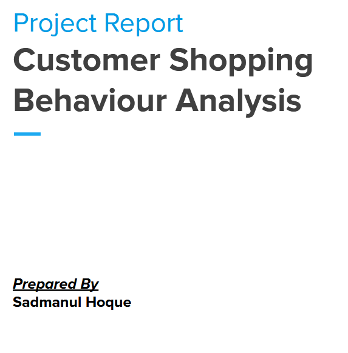
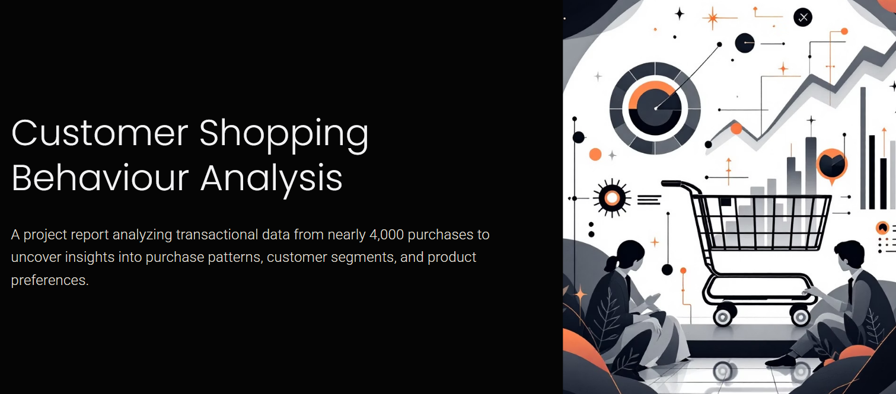

# 🛍️ Customer Shopping Behaviour Analysis


---

## 📖 Project Overview

This project analyzes **customer shopping behaviour** using transactional data from nearly **4,000 purchases** across various product categories.  
The objective is to uncover insights into:

- Purchase patterns  
- Customer segmentation  
- Product and category performance  
- Gender- and age-based spending  
- Revenue optimization opportunities  

The findings guide **data-driven business decisions** to improve marketing, customer engagement, and sales strategy.

---


## 📄 Report & Presentation Previews

<p align="center">
  <a href="report.pdf">
    
  </a>
  <a href="slide.pptx">
    
  </a>
</p>


## 🧹 Data Cleaning (Python)

- ✅ Handled missing data  
- ✅ Renamed and standardized columns  
- ✅ Feature engineering for better grouping and aggregation  
- ✅ Ensured data type consistency  

---

## 📊 Data Analysis (SQL)

SQL was used to analyze cleaned data stored in a relational database.  
Key insights were derived through **structured queries** such as:

### 🔹 Q1: Product Performance
```sql
WITH sales_data AS(
    SELECT item_purchased AS product_name,
           SUM(purchase_amount) AS current_sales
    FROM customer
    GROUP BY item_purchased
)
SELECT product_name, current_sales,
       (SELECT AVG(current_sales) FROM sales_data) AS average_sales,
       current_sales - (SELECT AVG(current_sales) FROM sales_data) AS sales_difference,
       CASE
           WHEN current_sales - (SELECT AVG(current_sales) FROM sales_data) > 0 THEN 'Profit'
           WHEN current_sales - (SELECT AVG(current_sales) FROM sales_data) < 0 THEN 'Loss'
           ELSE 'Average'
       END AS performance
FROM sales_data;
```

### 🔹 Q2: Category Performance
```sql
WITH sales_data AS(
    SELECT category, SUM(purchase_amount) AS sales
    FROM customer
    GROUP BY category
)
SELECT category, sales,
       CONCAT(ROUND((CAST(sales AS FLOAT) / (SELECT SUM(purchase_amount) FROM customer))*100, 2), '%') AS sale_percent
FROM sales_data;
```

### 🔹 Additional Queries
| Query | Description |
|-------|--------------|
| Q3 | Total revenue generated by male vs. female customers |
| Q4 | Customers who used discounts but spent more than average |
| Q5 | Top 5 products with highest average review rating |
| Q6 | Comparison of average purchase amounts between shipping types |
| Q7 | Spending comparison between subscribed vs. non-subscribed customers |
| Q8 | Products with highest discount usage percentage |
| Q9 | Segment customers into VIP, Regular, and New |
| Q10 | Top 3 most purchased products per category |
| Q11 | Correlation between previous purchases and subscription likelihood |
| Q12 | Revenue contribution by age group |

---

## 📈 Key Findings

- 🏆 **Top-performing products** significantly exceeded average sales.  
- 💰 **Female customers** contributed slightly more to total revenue.  
- 🚀 **Subscribed customers** spent more frequently and had higher lifetime value.  
- 🛒 **VIP customers** (10+ previous purchases) generated the largest revenue share.  
- 📦 **Express shipping** correlated with higher purchase amounts.  

---

## ⚙️ Tools & Technologies

| Category | Tools Used |
|-----------|-------------|
| Programming | Python (Pandas, NumPy) |
| Database | MySQL / SQLite |
| Visualization | Matplotlib, Seaborn, Power BI |
| Reporting | Excel, PowerPoint |
| Version Control | Git & GitHub |

---

## 📊 Visuals

Add your analysis dashboards and visual outputs here:

```markdown


```
*(Replace the image paths with your actual files.)*

---

## 🧠 Insights Summary

| Area | Key Takeaway |
|------|---------------|
| Product | Certain products outperform the average sales benchmark significantly. |
| Customer Segments | VIP customers provide the highest lifetime value. |
| Discounts | Discounts drive sales volume but not always higher revenue. |
| Gender | Female customers slightly outspend male customers overall. |
| Shipping | Express shipping customers spend more on average. |

---

## 📁 Project Structure

```
Customer-Shopping-Behaviour-Analysis/
│
├── data/
│   └── customer.csv
│
├── notebooks/
│   ├── data_cleaning.ipynb
│   ├── sql_analysis.ipynb
│
├── visuals/
│   ├── dashboard_overview.png
│   ├── category_chart.png
│   ├── customer_segments.png
│
├── Report.pdf
├── README.md
└── LICENSE
```

---

## 🧩 How to Run This Project

1. **Clone the Repository**
   ```bash
   git clone https://github.com/yourusername/Customer-Shopping-Behaviour-Analysis.git
   cd Customer-Shopping-Behaviour-Analysis
   ```

2. **Install Required Libraries**
   ```bash
   pip install pandas numpy matplotlib seaborn
   ```

3. **Run the Python Notebook**
   - Open `data_cleaning.ipynb` and execute all cells.
   - Connect your SQL environment (MySQL/SQLite) to run the analysis queries.

4. **View the Dashboard**
   - Open Power BI or your visualization tool to explore the dataset insights.

---

## 💡 Future Improvements

- 🔍 Add predictive analysis for **customer churn** or **purchase forecasting**  
- 📊 Integrate **Tableau/Power BI dashboards** directly on GitHub Pages  
- 🧠 Apply **machine learning clustering** for customer segmentation  

---

## 👨‍💻 Author

**Sadmanul Hoque**  
📍 Bangladesh  
📧 your.email@example.com  
🌐 [LinkedIn Profile](https://linkedin.com/in/yourprofile)  
💾 [GitHub Profile](https://github.com/yourusername)

---

## 📜 License

This project is licensed under the **MIT License** — see the [LICENSE](LICENSE) file for details.

---

⭐ *If you found this project helpful, please give it a star on GitHub!*

