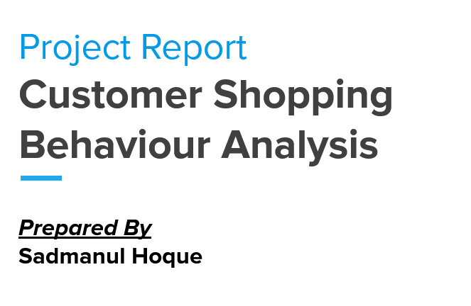

# 🛍️ Customer Shopping Behaviour Analysis


---

## 📖 Project Overview

This project analyzes **customer shopping behaviour** using transactional data from nearly **4,000 purchases** across various product categories.  
The objective is to uncover insights into:

- Purchase patterns  
- Customer segmentation  
- Product and category performance  
- Gender- and age-based spending  
- Revenue optimization opportunities  

The findings guide **data-driven business decisions** to improve marketing, customer engagement, and sales strategy.

---


## 📄 Report & Presentation Previews

<p align="center">
  <a href="https://github.com/masterArnob/Customer-Shopping-Behaviour-Analysis/blob/main/Report/Report.pdf">
    
  </a>
  <a href="https://github.com/masterArnob/Customer-Shopping-Behaviour-Analysis/blob/main/Presentation%20Slide/Customer-Shopping-Behaviour-Analysis.pdf">
    
  </a>
</p>

<p align="center">
  <a href="https://github.com/masterArnob/Customer-Shopping-Behaviour-Analysis/blob/main/Report/Report.pdf" style="text-decoration: none; color: inherit;">
    <strong>📄 View Report</strong>
  </a>
  &nbsp;&nbsp;&nbsp;|&nbsp;&nbsp;&nbsp;
  <a href="https://github.com/masterArnob/Customer-Shopping-Behaviour-Analysis/blob/main/Presentation%20Slide/Customer-Shopping-Behaviour-Analysis.pdf" style="text-decoration: none; color: inherit;">
    <strong>🎞️ View Slide</strong>
  </a>
</p>


## 🧹 Data Cleaning (Python)

- ✅ Handled missing data  
- ✅ Renamed and standardized columns  
- ✅ Feature engineering for better grouping and aggregation  
- ✅ Ensured data type consistency  

---

## 📊 Data Analysis (SQL)

## Analysis Questions
### Q1: Product Performance
```sql
-- Q: Product Performance

WITH sales_data AS(
SELECT
	item_purchased AS product_name,
	SUM(purchase_amount) AS current_sales
FROM customer
GROUP BY
	item_purchased
)
SELECT 
	product_name,
	current_sales,
	(SELECT AVG(current_sales) FROM sales_data) AS avarage_sales,
	current_sales - (SELECT AVG(current_sales) FROM sales_data) AS sales_difference,

CASE WHEN current_sales - (SELECT AVG(current_sales) FROM sales_data) > 0 THEN 'Profit'
	 WHEN current_sales - (SELECT AVG(current_sales) FROM sales_data) < 0 THEN 'Loss'
	 ELSE 'Avarage'
END performance

FROM sales_data;
```


### Q2: Category Performance
```sql
-- Q: Category Performance
WITH sales_data AS(
SELECT 
	category,
	SUM(purchase_amount) AS sales
FROM customer
GROUP BY
	category
)
SELECT 
	category,
	sales,
	(SELECT SUM(purchase_amount) FROM customer) AS overall_sales,
	CONCAT(ROUND((CAST(sales AS FLOAT) / (SELECT SUM(purchase_amount) FROM customer)) * 100, 2), '%') AS sale_percent
FROM sales_data;
```


### Q3: What are the total revenue generated by male vs female customers?
```sql
SELECT 
	gender,
	CONCAT('$', SUM(purchase_amount)) AS total_revenue
FROM customer
GROUP BY gender;
```


### Q4: Which Customers used discount but still spent more than the avarage purchase amount?
```sql
SELECT 
	customer_id,
	CONCAT('$', purchase_amount) AS spent
FROM
	customer
WHERE 
	discount_applied = 'Yes' 
	AND purchase_amount > (SELECT AVG(purchase_amount) FROM customer)
ORDER BY purchase_amount DESC;
```


### Q5: Whcih are the top 5 products with the highest avarage review rating?
```sql
SELECT TOP 5
	item_purchased,
	AVG(review_rating) AS avg_rating
FROM customer
GROUP BY item_purchased
ORDER BY
	AVG(review_rating) DESC;
```


### Q6: Compare the avarage purchase amounts between standard and express shippings.
```sql
SELECT
	shipping_type,
	CONCAT('$', AVG(purchase_amount)) AS avg_purchase_amount
FROM customer
WHERE shipping_type IN('Standard', 'Express')
GROUP BY
	shipping_type;
```


### Q7: Do subscribe customer spand more? 
```sql
SELECT 
	subscription_status,
	CONCAT('$', AVG(purchase_amount)) AS spend,
	CONCAT('$', SUM(purchase_amount)) AS total_revenue
FROM customer
GROUP BY subscription_status;
```


### Q8: Which product have the highest percentage of the purchases with discount applied?
#### formula: percent = (no. of discount purchases / total purchase) X 100
```sql
SELECT TOP 5
	item_purchased,
	CONCAT((SUM(CASE WHEN discount_applied = 'Yes' THEN 1 ELSE 0 END) * 100 / COUNT(*)), '%') sale_percent
FROM customer
GROUP BY item_purchased
ORDER BY sale_percent DESC;
```


### Q9: Segment customer into  vip, regular, new based on the total previous purchases show the count segment
```sql
WITH segment AS(
SELECT 
	customer_id,
	previous_purchases,
CASE WHEN previous_purchases >= 10 THEN 'VIP'
     WHEN previous_purchases >= 5 THEN 'Regular'
	 ELSE 'New'
END customer_segment
FROM customer)
SELECT 
	customer_segment,
	COUNT(customer_id) AS total_customer
FROM segment
GROUP BY 
	customer_segment
ORDER BY COUNT(customer_id) DESC;
```


### Q10: What are the top 3 most purchased product withing each category?
```sql

WITH sales_data AS(
SELECT 
	category,
	item_purchased AS product_name,
	COUNT(item_purchased) AS sale_count
FROM customer
GROUP BY
	item_purchased,
	category
),
product_ranking AS(
SELECT 
	category,
	product_name,
	sale_count,
	ROW_NUMBER() OVER (PARTITION BY category ORDER BY sale_count DESC) AS ranking
FROM sales_data
)
SELECT 
	ranking,
	category,
	product_name,
	sale_count
FROM product_ranking
WHERE
	ranking <= 5
GROUP BY 
	category,
	product_name,
	sale_count,
	ranking;
```


### Q11: Are customers who have more than 5 previous purchases are likely to subscribe?
```sql
SELECT 
	subscription_status,
	COUNT(customer_id) AS total_customers
FROM customer
WHERE 
	previous_purchases > 5
GROUP BY 
	subscription_status;
```


### Q12: What is the revenue contribution of each age group?
```sql
SELECT
	age_group,
	CONCAT('$', SUM(purchase_amount)) AS total_revenue
FROM customer
GROUP BY
	age_group
ORDER BY SUM(purchase_amount) DESC
;
```


---

## 📈 Key Findings

- 🏆 **Top-performing products** significantly exceeded average sales.  
- 💰 **Female customers** contributed slightly more to total revenue.  
- 🚀 **Subscribed customers** spent more frequently and had higher lifetime value.  
- 🛒 **VIP customers** (10+ previous purchases) generated the largest revenue share.  
- 📦 **Express shipping** correlated with higher purchase amounts.  

---


## 👨‍💻 Author

**Sadmanul Hoque**   
📧 sadmnulhoque21@gmail.com  
🌐 [LinkedIn Profile](https://www.linkedin.com/in/sadmanul-hoque/)  
💾 [GitHub Profile](https://github.com/masterArnob)


